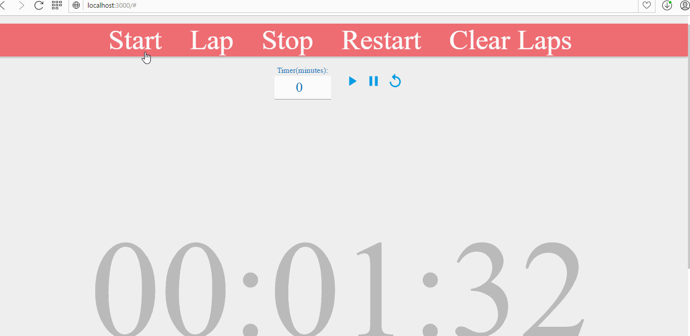

# **Stopwatch with ECMScript6**
## **Group**
- 1312474 - Triệu Xuân Quý
- 1312485 - Nguyễn Ngọc Sáng
- 1312498 - Trần Thị Sương
- 1312508 - Nguyễn Đăng Thiện Tâm
## **Introduction ES6**

ECMAScript 6, also known as ECMAScript 2015, is the latest version of the ECMAScript standard. ES6 is a significant update to the language, and the first update to the language since ES5 was standardized in 2009. Implementation of these features in major JavaScript engines is underway now.

ES6 includes the following new features:

- arrows
- classes
- enhanced object literals
- template strings
- destructuring
- ...
## **Stopwatch**
An application is used to illustrate a Stopwatch, which can measure elapsed time for one interval, or the total of elapsed time across multiple intervals. You will call the Start method, then eventually call the Stop method to stop the process. Beside, you can use the Reset method to clear elapsed time or using the Lap method to save each moment whhile the Stopwatch is running.

The application is built base on ES6, which includes the following new features:
- [arrows](#arrows)
- [classes](#classes)
- [default parameters](#default-parameters)
- [let & const](#let-&-const)
- [HTML Templace String](#HTML-Templace-String)
## Video Walkthrough
Here's a walkthrough:



GIF created with [LiceCap](http://www.cockos.com/licecap/).
### Arrows
Two factors influenced the introduction of arrow functions: shorter functions and lexical `this`.
```JavaScript
let pad0 = (value, count)=>{
    var result = value.toString();
    for (; result.length < count; --count)
        result = '0' + result;
    return result;
}
```
Until arrow functions, every new function defined its own `this` value (a new object in case of a constructor, undefined in strict mode function calls, the context object if the function is called as an "object method", etc.). This proved to be annoying with an object-oriented style of programming. In ECMAScript 3/5, this issue was fixed by assigning the value in `this` to a variable that could be closed over.
### Classes
ES6 classes are a simple sugar over the prototype-based OO pattern.  Having a single convenient declarative form makes class patterns easier to use, and encourages interoperability.  Classes support prototype-based inheritance,instance, static methods 
and constructors. 

Here is some code 
```JavaScript
let stopwatch = new Stopwatch(); //Error

class Stopwatch {
    constructor(display, results) {
        this.running = false;
        this.display = display;
        this.results = results;
        this.timer = false;
        this.laps = [];
        this.restarted = false;
        this.reset();
        this.print(this.times);
    }
    ...
}

let stopwatch = new Stopwatch(
    document.querySelector('.stopwatch'),
    document.querySelector('.results')); //True
```
The constructor method is a special method for creating and initializing an object created with a class. There can only be one special method with the name "constructor" in a class. A SyntaxError will be thrown if the class contains more than one occurrence of a constructor method. 

An important difference between function declarations and class declarations is that function declarations are hoisted and class declarations are not. You first need to declare your class and then access it, otherwise code like the following will throw a Error.

### Default parameters
Default function parameters allow formal parameters to be initialized with default values if no value or undefined is passed.

In JavaScript, parameters of functions default to `undefined`. However, in some situations it might be useful to set a different default value. This is where default parameters can help.
```JavaScript

```
### Let & const
ES6 provides a keyword `let` alows you to declare variable that are limited in scope to the block, statement, or expression on which it is used. This is unlike the var keyword, which defines a variable globally, or locally to an entire function regardless of block scope. 

Here is some code
```JavaScript
function varTest() {
  var x = 31;
  if (true) {
    var x = 71;  // same variable!
    console.log(x);  // 71
  }
  console.log(x);  // 71
}

function letTest() {
  let x = 31;
  if (true) {
    let x = 71;  // different variable
    console.log(x);  // 71
  }
  console.log(x);  // 31
}
```
Variables declared by let have as their scope the block in which they are defined, as well as in any contained sub-blocks . In this way, let works very much like var. The main difference is that the scope of a var variable is the entire enclosing function. Therefore, depending on some cases we will consider to use `let`.

`const` is single-assignment. Static restrictions prevent use before assignment.
```JavaScript
const alarmSound = new Audio('mp3/06_Urban_Beat.mp3');
```
Constants are block-scoped, much like variables defined using the let statement. The value of a constant cannot change through re-assignment, and it can't be redeclared.

All the considerations about the "temporal dead zone" that apply to let, also apply to const.

A constant cannot share its name with a function or a variable in the same scope.
### HTML Template String
Template strings provide syntactic sugar for constructing strings. One of their first real benefits is string substitution. Substitution allows us to take any valid JavaScript expression (including say, the addition of variables) and inside a Template Literal, the result will be output as part of the same string.

Template Strings can contain placeholders for string substitution using the ${ } syntax, as demonstrated below:

```JavaScript
format(times) {
	return `\
	${pad0(times[0], 2)}:\
	${pad0(times[1], 2)}:\
	${pad0(Math.floor(times[2]), 2)}`;
} //The ${} works fine with any kind of expression
```
Template Strings use back-ticks (``) rather than the single or double quotes we’re used to with regular strings. Multiline strings in JavaScript have required hacky workarounds for some time. Current solutions for them require that strings either exist on a single line or be split into multiline strings using a \ (blackslash) before each newline.

## License

    Copyright [yyyy] [name of copyright owner]

    Licensed under the Apache License, Version 2.0 (the "License");
    you may not use this file except in compliance with the License.
    You may obtain a copy of the License at

        http://www.apache.org/licenses/LICENSE-2.0

    Unless required by applicable law or agreed to in writing, software
    distributed under the License is distributed on an "AS IS" BASIS,
    WITHOUT WARRANTIES OR CONDITIONS OF ANY KIND, either express or implied.
    See the License for the specific language governing permissions and
    limitations under the License.